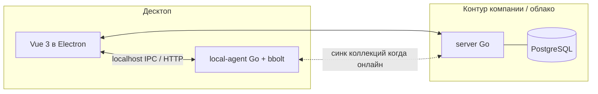

# Инженерное ТЗ (черновик) — клиент API «Postman для РФ»

**Версия:** 0.5  
**Связанный документ:** [PRD.md](./PRD.md) v0.11  
**Назначение:** архитектура, границы компонентов, контракты и порядок работ для v1.

---

## 1. Репозитории (три отдельных git)

Код ведётся в **трёх независимых репозиториях**; в рабочей копии они могут лежать соседними папками или клонами из одной «мета» директории (см. [README.md](./README.md)).

| Репозиторий | Каталог в мета-проекте | Ответственность |
|-------------|------------------------|-----------------|
| **pathawk-server** | `server/` | Go + PostgreSQL: API, шаринг, SSO/OAuth, аудит |
| **pathawk-web** | `web/` | Vue 3: общий UI (веб и десктоп) |
| **pathawk-desktop** | `desktop/` | Electron + упаковка UI из **pathawk-web**; вложенный **`local-agent/`** (Go + bbolt) |

**Связка:** `pathawk-desktop` подключает UI через `npm` (`file:../web`, git-URL или опубликованный пакет). Версии API между **server** и клиентами фиксируются в OpenAPI / semver.

Десктоп **обязан** поставлять бинарь `local-agent` рядом с Electron; сборка агента — из каталога `desktop/local-agent/`.

---

## 2. Высокоуровневая архитектура

- **UI** не ходит в bbolt напрямую: только через **local-agent** (единая точка для транзакций и миграций схемы KV).
- **HTTP/WebSocket к целевым API** в v1: допускается реализация в **Electron main** (Node) или делегирование в **local-agent** — выбрать один путь в первом спринте и не смешивать без причины (рекомендация: **запросы из main process** Node для зрелости экосистемы; local-agent — только стор и, при необходимости, прокси).

---

## 3. local-agent (Go + bbolt)

### 3.1 Назначение

- Персистентность коллекций, окружений, истории, настроек **офлайн**.
- Один файл БД на workspace/профиль (путь задаётся аргументом или переменной окружения).
- API для UI: предпочтительно **HTTP на 127.0.0.1** на динамическом порту (проще отладка, чем cgo IPC) или **stdin/stdout JSON-RPC** — зафиксировать в задаче «E0» (см. §8).

### 3.2 Ключи bbolt (черновик схемы)

Бакеты верхнего уровня (имена — пример):

| Bucket | Содержимое |
|--------|------------|
| `meta` | `schema_version`, `app_version` |
| `collections` | ключ `collection_id` → JSON документ коллекции (или нормализованные подбакеты в v1.1) |
| `environments` | ключ `env_id` → JSON |
| `history` | ключ `timestamp_uuid` → запись истории (ограничить глубину в ТЗ эксплуатации) |

Полная нормализация (отдельные бакеты для items) — по мере роста размера коллекций; для v1 допустим **документный JSON** на коллекцию с вложенными папками/запросами при соблюдении лимита размера (например предупреждение > N МБ).

### 3.3 Конкурентный доступ

Один writer — local-agent; Electron не открывает файл bbolt самостоятельно.

---

## 4. server (Go + PostgreSQL)

### 4.1 Обязанности v1

- Пользователи и сессии; **OAuth** (Яндекс и др.) и **SSO** SAML/OIDC — библиотеки и порядок включения в отдельном поддокументе `docs/AUTH.md` (создать при реализации).
- Хранение **опубликованных** коллекций для шаринга; **приглашения по email**; **публичные ссылки** с TTL и отзывом.
- **Аудит:** события минимум: `login_success`, `login_fail`, `collection_publish`, `collection_unpublish`, `share_link_create`, `share_link_revoke`, `invite_send`, `collection_fetch` (уточнить объём PII в логах для 152-ФЗ).

### 4.2 API (черновик префикса `/api/v1`)

| Метод | Путь | Назначение |
|--------|------|------------|
| GET | `/health` | liveness |
| POST | `/auth/oauth/{provider}/callback` | обработка OAuth (детали в AUTH) |
| POST | `/collections` | загрузить снимок коллекции (тело JSON) |
| GET | `/collections/{id}` | получить коллекцию (по правам доступа) |
| POST | `/collections/{id}/invite` | приглашение на email |
| POST | `/collections/{id}/public-link` | создать публичную ссылку |
| DELETE | `/public-links/{token}` | отозвать ссылку |

Схемы тел и коды ошибок — OpenAPI в репозитории (генерация позже).

### 4.3 Деплой

- Артефакты: Docker Compose (`server` + `postgres`) или бинарь + внешний Postgres.
- Конфиг через env: `DATABASE_URL`, `SMTP_*`, `OAUTH_*`, `BASE_URL` для ссылок в письмах.

---

## 5. desktop (Electron + Vue 3)

### 5.1 Обязанности

- Окна, меню, авт обновления (политика позже), запуск **local-agent** при старте, остановка при выходе.
- **i18n:** `ru`, `en`.
- Рендер запросов/ответов; крупные тела — виртуализация по необходимости.

### 5.2 Связь с local-agent

- Main process резолвит порт агента и передаёт в renderer через `contextBridge` (без nodeIntegration в renderer при возможности).

### 5.3 Git и коллекции (MVP: только настройки)

- **UI:** в activity rail добавлен раздел **Git**; в навигационной колонке — список подключённых репозиториев, выбор **активного** и поля: remote URL, локальный путь, ветка, путь к каталогу коллекций внутри репо, режим синхронизации (пока «вручную»), политика конфликтов.
- **Несколько репозиториев:** в один момент один **активный**; остальные хранятся в списке. Удаление последнего репозитория запрещено.
- **Конфликты (по умолчанию):** `lastWriteWins` — в UI показано предупреждение: при появлении настоящей синхронизации побеждает последняя запись, возможна потеря чужих правок; для команды рекомендуется договорённость о границах коллекций или смена стратегии, когда появятся `manual` / `branchPerUser` и движок sync.
- **Персистенция (MVP):** настройки лежат в `localStorage` (ключ `pathawk-git-workspace-settings`); перенос в bbolt/local-agent — **фаза 2** (см. опциональные методы `window.agent.listGitRepos` / `saveGitRepo` / `deleteGitRepo` / `setActiveGitRepo` в `web/src/vite-env.d.ts`).
- **Фаза 2 (не в MVP):** `git clone` / `fetch` / `pull` / `commit` / `push`, хранение токенов, разрешение конфликтов на уровне файлов, привязка коллекций bbolt к файлам в клоне.

---

## 6. Импорт / экспорт

| Формат | v1 |
|--------|-----|
| Postman Collection | v2.1 import + export (подмножество: папки, запросы, базовые поля; скрипты tests — импорт игнорировать или сохранять как текст без исполнения) |
| OpenAPI | 3.x import → коллекция; export «best effort» в 3.x из структуры коллекции |

Набор эталонных файлов для регрессии — в `testdata/` (добавить в задачах).

---

## 7. Безопасность (минимум v1)

- Секреты в UI: маскирование; в bbolt — шифрование at-rest опционально (post-v1); передача на сервер только по HTTPS.
- Публичные ссылки: неиндексируемые токены достаточной длины; rate limit на выдачу.
- Зависимости: регулярный аудит `npm` и `go list -m all`.

---

## 8. Эпики и порядок (один разработчик + ИИ)

| Эпик | Содержание | Критерий «готово» |
|------|------------|-------------------|
| **E0** | Три репо: сборка `server`, `web` (`npm run build`), `desktop` + `local-agent`; скелет Electron | `desktop`: `npm run dev` (Vite + Electron), `npm run build:pack` (агент + renderer); CI — по мере подключения |
| **E1** | local-agent: bbolt, CRUD коллекции + окружения по HTTP/IPC; схема `meta.schema_version` | **Сделано:** HTTP `GET/PUT/DELETE /api/v1/collections/{id}`, список `GET /api/v1/collections`; Electron поднимает агент (бинарь или `go run`), IPC `window.agent.*`; UI: список/демо/удаление. Окружения — следующий инкремент. |
| **E2** | Desktop: один экран «запрос»: метод, URL, headers, body JSON, отправка через main, ответ | **Сделано:** `HttpRequestPanel`, IPC `http:request` → `fetch` в main; только `http`/`https`; Linux dev: `ELECTRON_DISABLE_SANDBOX=1` в npm-скриптах. |
| **E3** | Дерево коллекций, привязка запроса к коллекции, экспорт JSON | **Сделано:** выбор коллекции, `requests[]` в документе, «Сохранить запрос в коллекцию», «В редактор», удаление запроса, экспорт `.json`; папки `folders` в схеме зарезервированы. |
| **E4** | Переменные окружения, подстановка в URL/headers/body | **Сделано:** bbolt `environments`, REST `GET/PUT/DELETE /api/v1/environments/{id}`; UI: выбор окружения, JSON переменных, синк в local-agent; подстановка `{{key}}` в панели запроса перед IPC. |
| **E5** | WebSocket вкладка (минимум) | Smoke-сценарий к echo-серверу |
| **E6** | Импорт Postman + OpenAPI | 3+ эталонных файла без падения |
| **E7** | server + Postgres: миграции, health, сохранение/выдача коллекции | Docker compose up → curl |
| **E8** | Шаринг: email invite + public link + SMTP | E2E с тестовым SMTP (mailhog) |
| **E9** | SSO SAML/OIDC + OAuth Яндекс | По одному happy-path на среду |
| **E10** | Аудит + экспорт для админа | Просмотр событий в UI или API |

Параллель **E7–E10** с **E2–E6** возможен после стабилизации контракта API между desktop и server.

---

## 9. Открытые инженерные решения

- Точный транспорт UI ↔ local-agent (HTTP localhost vs JSON-RPC).
- Исполнение HTTP из Node vs Go (финальная фиксация в E2).
- Версионирование миграций bbolt при смене `schema_version`.

---

*Документ живой; изменения ссылкой на PRD и версию TECH_SPEC.*
